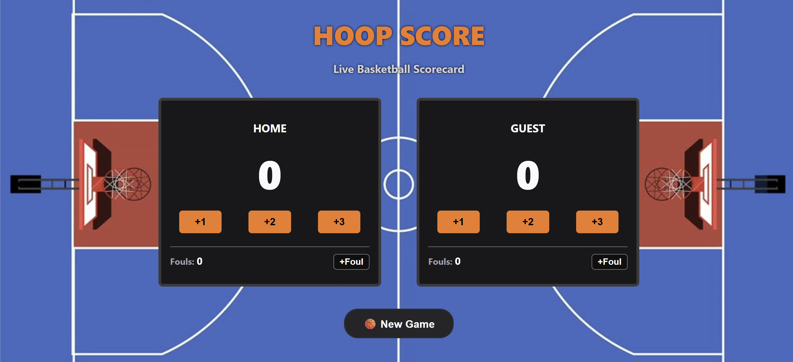

# 🏀 Basketball Scoreboard

An interactive basketball scoreboard built with **HTML5, CSS3, and JavaScript**.  
Tracks scores, fouls, and highlights the leading team in real-time.

## 📌 Features
- Real-time scoring with +1, +2, +3 buttons for Home and Guest teams
- Foul counters for both teams
- Leader highlighting to visually indicate which team is ahead
- New Game button to reset all scores and fouls
- Responsive layout using CSS Flexbox

## 🛠 Tech Stack
- HTML5  
- CSS3 (Flexbox for layout)  
- JavaScript (DOM manipulation)

## 📷 Preview


## 📁 Folder Structure

```
basketball-scoreboard/
│
├── index.html          # Main HTML file
├── index.css           # Stylesheet
├── index.js            # JavaScript functionality
├── README.md           # Project documentation
└── assets/
    ├── screenshot.png  # (optional) Screenshot for README preview
```
